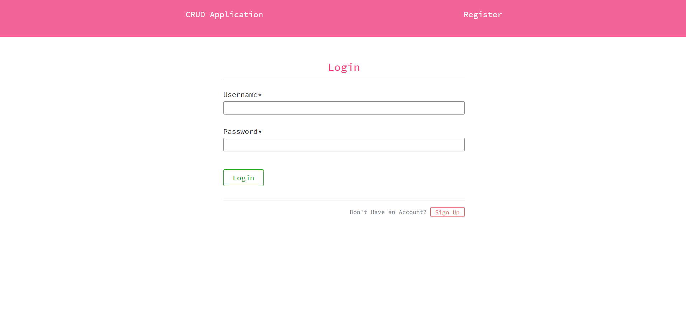
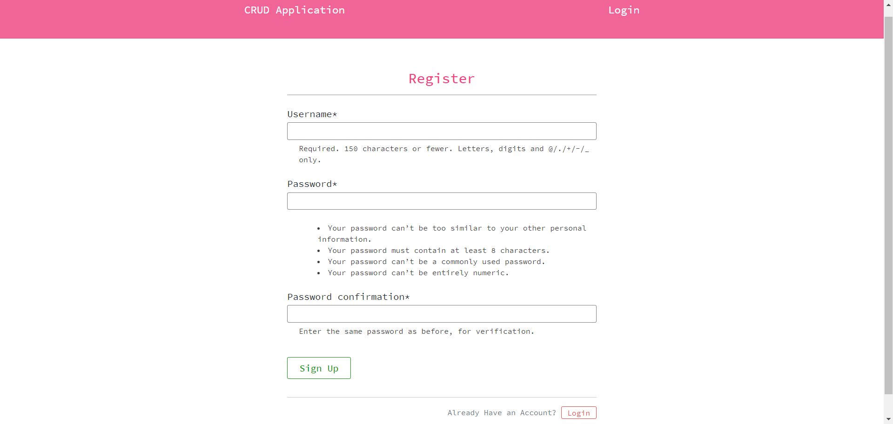

# CRUD Application using Django

Django CRUD application that has pagination and user authentication.


## Screenshots





## Demo

DJANGO_CRUD_APP_DEMO_LINK - https://streamable.com/nul933


## Features

- User Authentication
- Create, update and delete Todo Items.
- Pagination
- Mark todo item as completed

  
## Run Locally

Clone the project

```bash
  git clone https://github.com/Gokulancv10/Django-CRUD-Application.git
```

Virtual Environment is required to run *crud_app* project
```bash
  pip install virtualenv
        or
  pip3 install virtualenv

  # verifying virtual environment is installed
  virtualenv --version
```

Create Virtual Environment
```bash
virtualenv env

# Activate virtual environment
env\Scripts\activate - For Windows
env/bin/activate - For Ubuntu
```

Go to the project directory

```bash
  cd crud_app
```

Install dependencies

```bash
  pip install -r requirements.txt
```

Start the server

```bash
  python manage.py runserver
```


## Tech Stack

**Client:** HTML, CSS, Bootstrap

**Server:** Django


## 🔗 Links
[](https://www.linkedin.com/in/gokulan-cv/)

[](https://twitter.com/cvgokulan1)
